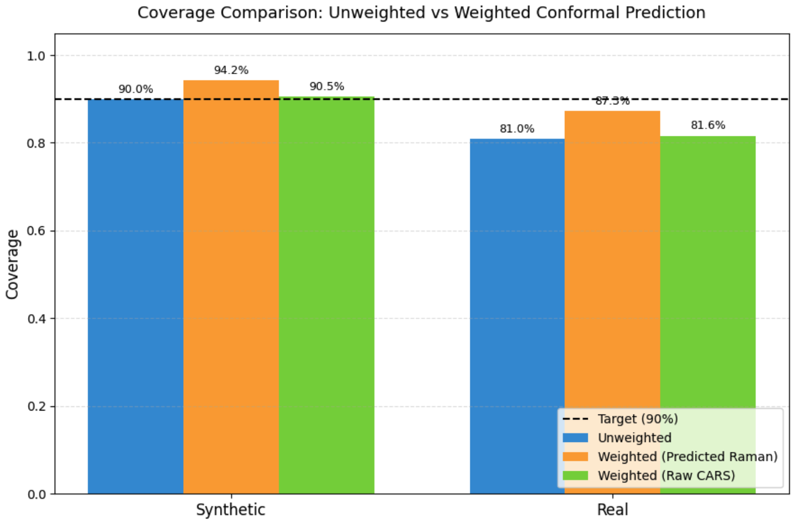

# Raman Spectroscopy under Distribution Shift

This repository contains notebooks and saved outputs for synthetic CARS–Raman data generation, Raman spectrum estimation, and uncertainty analysis under synthetic-to-real distribution shift.

## Project overview

The project explores how a neural network can estimate Raman spectra from coherent anti-Stokes Raman scattering (CARS) measurements, and how prediction coverage changes when evaluating on real solvent measurements.

The workflow includes:

1. Synthetic CARS and Raman data generation.
2. Neural network training and Raman prediction.
3. Conformal prediction calibration on synthetic data.
4. Evaluation of prediction coverage on real solvent data.
5. Comparison of unweighted and density-ratio-weighted calibration.

The model uses a one-dimensional residual neural network. Its training objective combines spectral reconstruction error, Hilbert-transform consistency, and a smoothness penalty for the non-resonant background.

## Repository contents

```text
.
├── CARS and Raman Synthetic data .ipynb
├── Raman Training and Uncertainty in Distribution_Shift.ipynb
├── X_cars_2000x640.npy
├── y_raman_2000x640.npy
├── dataset_Mukesh/
│   └── dataset_Mukesh/
├── Final_Predictions/
├── Weighted_and_Unweighted_Distribution.png
├── .gitignore
└── README.md
```

- **`CARS and Raman Synthetic data .ipynb`** — notebook for generating synthetic CARS and Raman data.
- **`X_cars_2000x640.npy`** and **`y_raman_2000x640.npy`** — generated arrays; their filenames indicate 2,000 rows and 640 columns.
- **`Raman Training and Uncertainty in Distribution_Shift.ipynb`** — training, prediction, and uncertainty-analysis workflow.
- **`dataset_Mukesh/dataset_Mukesh/`** — dataset files used for solvent evaluation.
- **`Final_Predictions/`** — saved model and prediction artifacts from the run used for the final report.
- **`Weighted_and_Unweighted_Distribution.png`** — coverage comparison plot.

## Coverage results

The plot compares empirical coverage with the 90% target. In the displayed run, synthetic coverage was 90.0% for unweighted calibration, 94.2% for weighted calibration based on predicted Raman, and 90.5% for weighted calibration based on raw CARS.

On the real evaluation data, coverage was 81.0% for unweighted calibration, 87.3% for weighted calibration based on predicted Raman, and 81.6% for weighted calibration based on raw CARS. In this run, predicted-Raman weighting increased real-data coverage, though it remained below the 90% target.



*Figure: Empirical coverage for the displa
